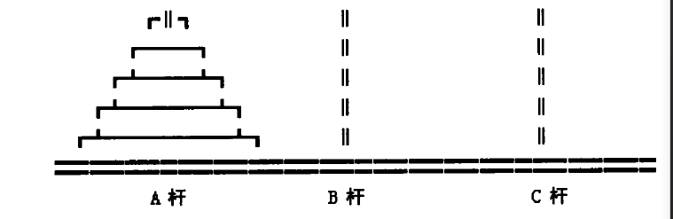
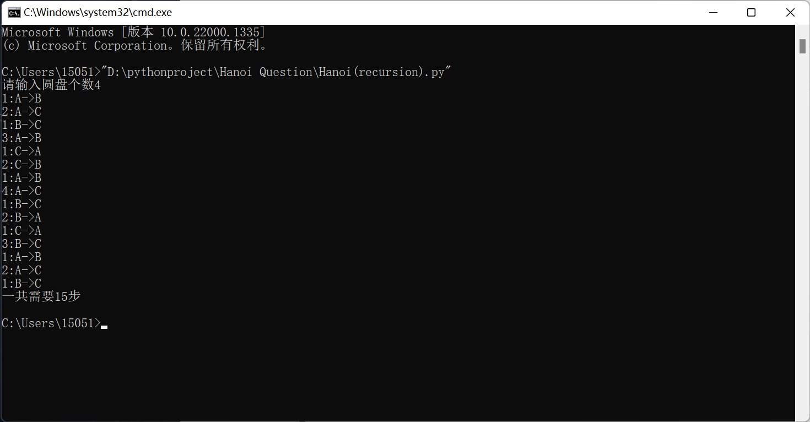
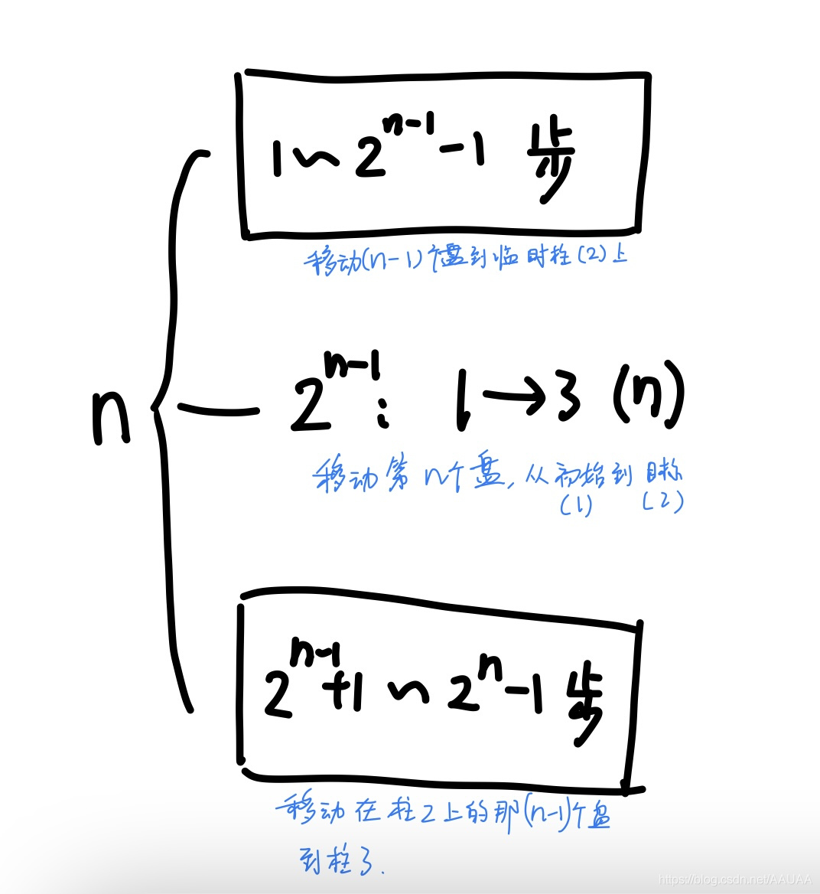
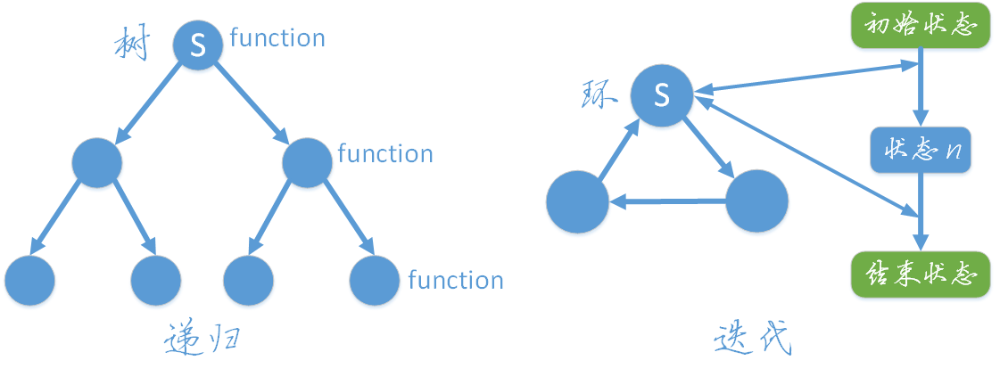
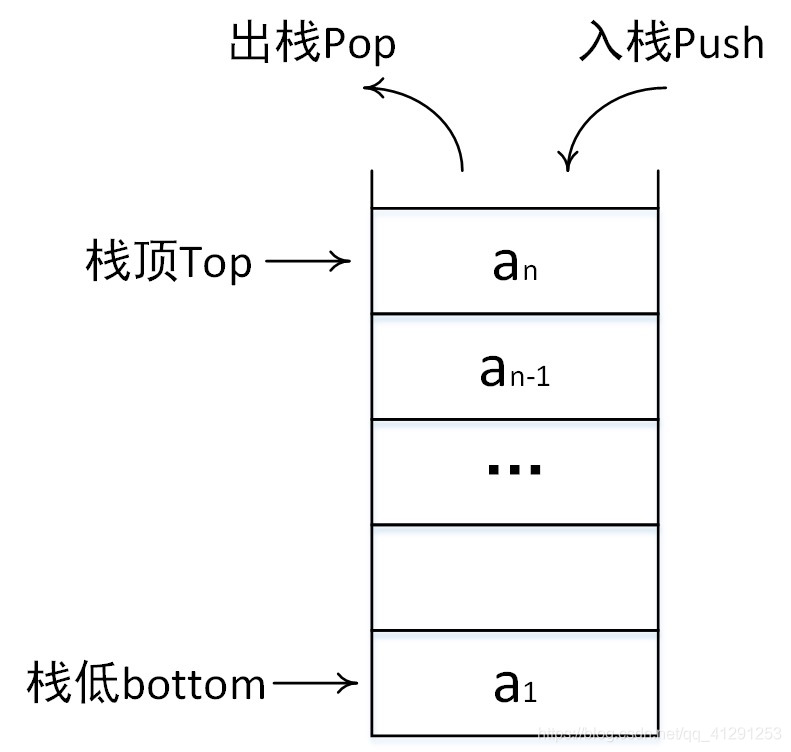

# 一、汉诺塔问题
## 1、汉诺塔的传说
汉诺塔问题来自一个古老的印度传说：在世界中心贝拿勒斯（在印度北部）的圣庙里，一块黄铜板上插着三根宝石针。印度教的主神梵天在创造世界的时候，在其中一根针上从==下到上地穿好了由大到小的64片金片==，这就是所谓的汉诺塔。不论白天黑夜，总有一个僧侣在按照下面的法则移动这些金片：==一次只移动一片，不管在哪根针上，小片必须在大片上面。==僧侣们预言，当所有的金片都从梵天穿好的那根针上移到另外一根针上时，世界就将在一声霹雳中消灭，而梵塔、庙宇和众生也都将同归于尽。
## 2、汉诺塔游戏

==游戏目标：把A杆上的金盘全部移到C杆上，并仍保持原有顺序叠好。==
==操作规则：每次只能移动一个盘子，并且在移动过程中三根杆上都始终保持大盘在下，小盘在上，操作过程中盘子可以置于A、B、C任一杆上。==
## 3、汉诺塔问题的理论分析
对于这样一个问题，任何人都不可能直接写出移动盘子的每一步，但我们可以利用下面的方法来解决。设移动盘子数为n，为了将这n个盘子从A杆移动到C杆，可以做以下三步：
1.以C盘为中介，从A杆将1至n-1号盘移至B杆；
2.将A杆中剩下的第n号盘移至C杆；
3.以A杆为中介；从B杆将1至n-1号盘移至C杆。
## 4、汉诺塔问题的代码实现
以上理论分析实则为汉诺塔问题的递归求法，将其转化为代码语言，即可利用计算机快速进行问题求解
以下给出Python和C++两种语言的递归方法的代码实现：
利用Python语言实现：

```python
count = 0
def hanoi(n, src, dst, mid):
    global count
    if n == 1:
        print("{}:{}->{}".format(1, src, dst))
        count += 1
    else:
        hanoi(n - 1, src, mid, dst)
        print("{}:{}->{}".format(n, src, dst))
        count += 1
        hanoi(n - 1, mid, dst, src)
x = eval(input("请输入圆盘个数"))
hanoi(x, "A", "C", "B")
print("一共需要{}步".format(count))
```

---

利用C++语言实现：

```cpp
#include<iostream>
using namespace std;
void hanoi(int n, char s, char d, char m);
int c = 0;
int main()
{
    int x = 0;
    cin >> x;
    hanoi(x, 'A', 'C', 'B');
    cout << "一共需要" << c << "步" << endl;
    system("pause");
    return 0;
}
void hanoi(int n,char s,char d,char m)
{
    if (n == 1)
    {
        cout << "1:" << s << "->" << d << endl;
        c++;
    }
    else
    {
        hanoi(n - 1, s, m, d);
        cout << n << ":" << s << "->" << d << endl;
        c++;
        hanoi(n - 1, m, d, s);
    }
}
```

---

事实上，两种代码实现的本质是相同的

## 5、汉诺塔问题迭代解法

以上两种实现方法均为迭代解法，那么汉诺塔问题是否有==递归解法==呢？答案显然是有的。

### （1）分解问题
每一步都可以分解为：
1. 决定移动的盘号（假如对n个盘子编号，从小到大为1~n）
2. 决定将盘子从哪移动到哪。

由此可知，要解决的问题就是：
1. 如何确定每一步对应那个盘子；
2. 如何确定盘子当前的位置和要移动的位置。

### （2）移动盘子并观察分析

运行上述代码并输入4，得到以下结果：

>请输入圆盘个数4
1:A->B
2:A->C
1:B->C
3:A->B
1:C->A
2:C->B
1:A->B
4:A->C
1:B->C
2:B->A
1:C->A
3:B->C
1:A->B
2:A->C
1:B->C
一共需要15步

观察上面的结果，可以知道:
1. 总步骤数为15（也就是$4^2-1$)
2. 移动1号盘的步骤为：[1,3,5,7,9,11,13,15] ,移动2号盘的步骤为[2,6,10,14]; 移动3号盘的步骤为[4,12]; 移动4号盘的步骤为[8]
3. 第一次移动1号盘在步骤1；第一次移动2号盘在步骤2；第一次移动3号盘在步骤4，第一次移动4号盘在步骤8。
移动1号盘间隔为2，2号盘间隔为4，3号盘间隔为8
猜测移动n号盘间隔为
$$ a_n=2^n $$
图解：

可以利用数学归纳法证明步骤间隔数和盘号的关系：
设移动总数为n的盘子
对于1号盘子:
因为移动了1号盘以后,下一步不可能再动1号,因此排除"存在任意连续的两步都移动1号"的假设.当移动了另外号码(假设a号)的盘子后(此时除1号呆的柱子,其他柱子上的盘子都比1号大),第三步一定会移动1号,因为移动之前a号下要么比a号大,要么没有盘子,同时不可能再把a号移回去(无效操作),因此只能挪动1号.得出:1号的步骤间隔为2.
设k号盘的步骤间隔=$2^k$ 成立
对于第k+1号盘子:
总过程分解到(k+1)的层次,共有$2^{(n-k-1)}$个分叉.每个分叉都代表移动k个盘子的$2^{(k-1)}-1$步,因此间隔数：
$$ a_{k+1} = 2^{k}-1+1+2^{k}-1+1 = 2^{k+1} $$
中间的+1代表移动k+2号盘的一步,最后的+1代表移动第二次移动k+1号盘的一步.
$\therefore$得证
第一次移动第k个盘子的步骤编号为：$2^{k-1}$

### （3）确定每一步移动的盘子
根据以上两个性质可得，在第（m）步时，定有某个盘（k）移动第（i）次，即：
$$m = 2^{k-1}+(i-1)*2^{k}$$
其中“2”的出现频率之高让人不禁想到二进制,或许可以利用二进制的某些特征来通过（m）反向确定（k）。当$i \neq 0$时，$(i-1)*2^{k}$一定大于$2^{k-1}$。也就是说式子的前半部分在二进制数中一直作为最低位的部分。（i）的大小不影响这一事实。
于是有：在第（m）步时，（m）所对应的二进制表示中最低为1的位数代表着移动的盘号。
### （4）移动的起始与终止
>1:A->B
2:A->C
1:B->C
3:A->B
1:C->A
2:C->B
1:A->B
4:A->C
1:B->C
2:B->A
1:C->A
3:B->C
1:A->B
2:A->C
1:B->C


观察4个盘子的移动过程，不难发现：
1号盘的路线是：1–2--3–1--2–3--1–2--3
2号盘的路线是：1–3--2–1--3
3号盘的路线是：1–2--3
4号盘的路线是：1–3
$\because$要避免重复回合
$\therefore$ 1号不会从1到2之后再从2到1，2到3、3到1同理，剩下（2、3、4）号盘的行动路线也同理,当一个盘子最初的移动定下来时，它的轨迹就已经决定了。

因此，产生了两种移动路线：
- 顺序：1–2--3–1
- 逆序：1–3--2–1

又:最后一个盘一定只有 1–3 这一步（默认初始都在1号，终点为3号）。分析可得，3号的移动轨迹和4号相反，2号和3号相反，1号和2号相反，且1号为顺序移动，以此类推。

总结出：

当移动总数为n的盘子时，第k个盘子的行动轨迹：
1. 与n相同[(n-k)为偶数]
2. 与n相反[(n-k)为奇数]

那么我们只要根据盘号确定每一个盘子的轨迹，并根据其移动次数i来确定始终即可。

### 5.总过程代码

此版本的代码如下：

```cpp
#include <iostream>
#include <bitset>//用于将数字转化为二进制
#include <sstream>//用于将数字转化为字符串
#include <string>
#include <cmath>
using namespace std;
int sum = 0;
void hanoi(unsigned int, int, int, int);
int lowestBit(int);
string movement(unsigned int, unsigned int, unsigned int, int, int, int);
string movementGenerator(int, int);
int main()
{
    unsigned int plateNum = 0;
    int ini = 0;//ini -- 起点
    int fin = 0; //fin -- 终点
    int tem = 0;//tem -- 临时点
    cout << "请输入圆盘个数: ";
    cin >> plateNum;
    cout << "请输入起点柱、终点柱、中转柱的编号: ";
    cin >> ini >> fin >> tem;
    hanoi(plateNum, ini, fin, tem);
}
//返回从右往左数第一个‘1’的位置
int lowestBit(int num)
{
    //初始化stringstream对象,
    //用于存储步骤数num的二进制形式的bitForm
    //和其字符串形式的bitString
    stringstream ss;
    bitset<32> bitForm = bitset<32>(num);//得到数字的二进制形式
    string bitString;
    //初始化盘号.
    //考虑到汉诺塔可能很高,所以用范围较大的 unsigned int
    unsigned int position = 0;
    //转换为字符串
    ss << bitForm;
    ss >> bitString;
    //for循环从右往左判定第一个1出现的位置
    for (unsigned int i = bitString.size(); i >= 0; i--)
    {
        if (bitString[i] == '1')
        {
            //注意,bitString的最右边有一个隐式的“\0”
            //因此若第一位为"1",此时 i = 31
            position = bitString.size() - i;
            break;
        }
    }
    return position;
}
string movement(unsigned int plateNum, unsigned int stepNum, unsigned int position, int ini, int fin, int tem)
{
    //根据盘号和步骤数,利用上面提供的 [步骤,盘号,次数] 三者的关系式逆推次数 i
    //由 i 判断具体移动
    //plateNum -- 盘子总数
    //stepNum -- 步骤数
    //position -- 盘号
    //ini -- 起点
    //fin -- 终点
    //tem -- 临时点
    //初始化移动次数moveTimes 和 字符串move
    unsigned int moveTimes = 0;
    string move;
    //计算moveTimes
    moveTimes = stepNum - static_cast<unsigned int>(pow(2, static_cast<double>(position) - 1));
    moveTimes /= static_cast<int>(pow(2, static_cast<double>(position)));
    moveTimes += 1;
    //用 moveTimes 判断具体行动
    if ((plateNum - position) % 2 == 0)
    {
        if ((moveTimes % 3) == 1)
            move = movementGenerator(ini, fin);
        else if ((moveTimes % 3) == 2)
            move = movementGenerator(fin, tem);
        else
            move = movementGenerator(tem, ini);
    }
    else
    {
        if ((moveTimes % 3) == 1)
            move = movementGenerator(ini, tem);
        else if ((moveTimes % 3) == 2)
            move = movementGenerator(tem, fin);
        else
            move = movementGenerator(fin, ini);
    }
    return move;
}
//返回对应的行动轨迹字符串
string movementGenerator(int start, int end)
{
    stringstream ss;
    string moveString;
    ss << start;
    ss << "->";
    ss << end;
    ss >> moveString;
    sum++;
    return moveString;
}
//总函数hanoi
void hanoi(unsigned int plateNum, int ini, int fin, int tem)
{
    unsigned int position;
    string move;
    for (unsigned int i = 1; i <= pow(2, static_cast<double>(plateNum)) - 1; i++)
    {
        position = lowestBit(i);
        move = movement(plateNum, i, position, ini, fin, tem);
        cout << move << endl;
    }
    cout << "总共需要" << sum << "步" << endl;
}
```
# 二、迭代与递归问题的转化
既然汉诺塔问题可以用迭代方法实现，那么，是否所有的递归问题都有迭代解法呢？
## 1、迭代与递归的深入认识
### (1)递归(recursion)
递归（recursion）：递归常被用来描述以自相似方法重复事物的过程，在数学和计算机科学中，指的是在函数定义中使用函数自身的方法。（A调用A）

#### 1.递归在函数中的具体形式：
1. 必须明确终止条件，并给出终止时的处理
2. 必须有间接或直接调用自身解决小规模问题的步骤
```
def recursion(大规模问题)：

　　if end_condition:              #终止条件

　　　　end                        #终止的处理

　　else:

　　　　recursion(小规模子问题)　　　#调用自身
```
#### 2.递归的应用：
1. 问题的定义是按递归定义的（Fibonacci函数，阶乘，…）；
2. 问题的解法是递归的（有些问题只能使用递归方法来解决，例如，汉诺塔问题，…）；
3. 数据结构是递归的（链表、树等的操作，包括树的遍历，树的深度，…）
#### 3.递归的优缺点
1. 递归的优点：简洁，容易处理问题，代码可读性高
2. 递归的缺点：时间和空间消耗大
### (2)迭代(iterator)
迭代（iteration）：重复反馈过程的活动，每一次迭代的结果会作为下一次迭代的初始值。（A重复调用B）
#### 1.迭代在程序中的表示：
1. 必须设置计数器，可以通过计数设置或条件设置，否则会一直迭代
2. 必须有返回值可以作为再次迭代的初值
```
def iteration(A):

　　return B

C

for i in range(n):

　　C=interation(C)
```
#### 2.迭代的优缺点
1. 优点：代码效率高，时间空间消耗比递归小
2. 缺点：不够简洁，容易混淆

### (3)递归与迭代的结构比较
递归是一个树结构，从字面可以其理解为重复“递推”和“回归”的过程，当“递推”到达底部时就会开始“回归”，其过程相当于树的深度优先遍历。

迭代是一个环结构，从初始状态开始，每次迭代都遍历这个环，并更新状态，多次迭代直到到达结束状态。



## 2、迭代与递归的转化
理论上，所都的迭代问题都可以转化为递归问题，所有的递归问题也都可以转化为迭代问题。
递归问题向迭代问题转化分为以下两种情况：尾递归和非尾递归。
### 1.尾递归
尾递归是递归的特殊情况，函数在return的时候调用自身。尾递归可以简单的转化为迭代方式。
思路：可以通过简单的变换，让递归作为最后一条语句，并且仅有此一个递归调用。
示例：
```cpp
int fact1(int n)//recursion
{
    if (n == 1 || n == 0)
        return 1;
    else
        return n * fact1(n - 1);
}

int fact2(int n)//iteration
{
    int s = 1;
    for (int i = 1; i <= n; i++)
        s *= i;
    return s;
}
```
以上代码为计算阶乘函数的迭代与递归方法实现，该递归为尾递归，可以简单由递归方法转变为迭代方法。
### 2.非尾递归
除尾递归外的其他递归为非尾递归。要将非尾递归问题转化为迭代问题，一般需要利用堆栈的方法来实现，即利用堆栈模拟函数调用的堆栈。
#### 1.栈的简单介绍
栈(stack)是一种特殊的线性表，其插入（也称入栈或压栈）和删除（也称出栈或弹栈）操作都在表的同一端进行。这一端被称为栈顶(top)，另一端被称为栈底(bottom)。

#### 2.非尾递归转化为迭代的一般思路
将递归转换为迭代的通常只需要两步：
1. 在函数中使用栈数据结构，以取代系统调用栈的作用。在每一次递归出现时，将参数作为一个新元素压入到栈中，来代替递归调用。
2. 在栈上做一个循环操作。递归的调用链就被迭代的循环操作替代了。
#### 3.非尾递归转化为迭代（利用栈）
```cpp
//注：这里的partition函数省略
void QuickSort1(int beg, int end)
{
    if (end - beg <= 1) return;
    int pos = partition(beg, end);
    QuickSort1(beg, pos);
    QuickSort1(pos + 1, end);
}
//利用堆栈转成成迭代版本
void QuickSort2(int beg, int end)
{
    stack<pair<int, int>> temp_stack;//利用堆栈来保存begin和end的值
    temp_stack.push((pair<int, int>)(beg, end));
    while (!temp_stack.empty())//堆栈不为空则继续循环
    {
        pair<int, int>  tmp = temp_stack.top();
        temp_stack.pop();//模拟函数调用，去除栈顶元素，对其进行处理
        if (tmp.second - tmp.first > 1)//和递归版本一样，只剩两个数的时候结束递归，否则继续压栈
        {
            int pos = partition(beg, end);
            temp_stack.push(pair<int, int>(tmp.first, pos));
            temp_stack.push(pair<int, int>(pos + 1, tmp.second));
        }
    }
}
```
